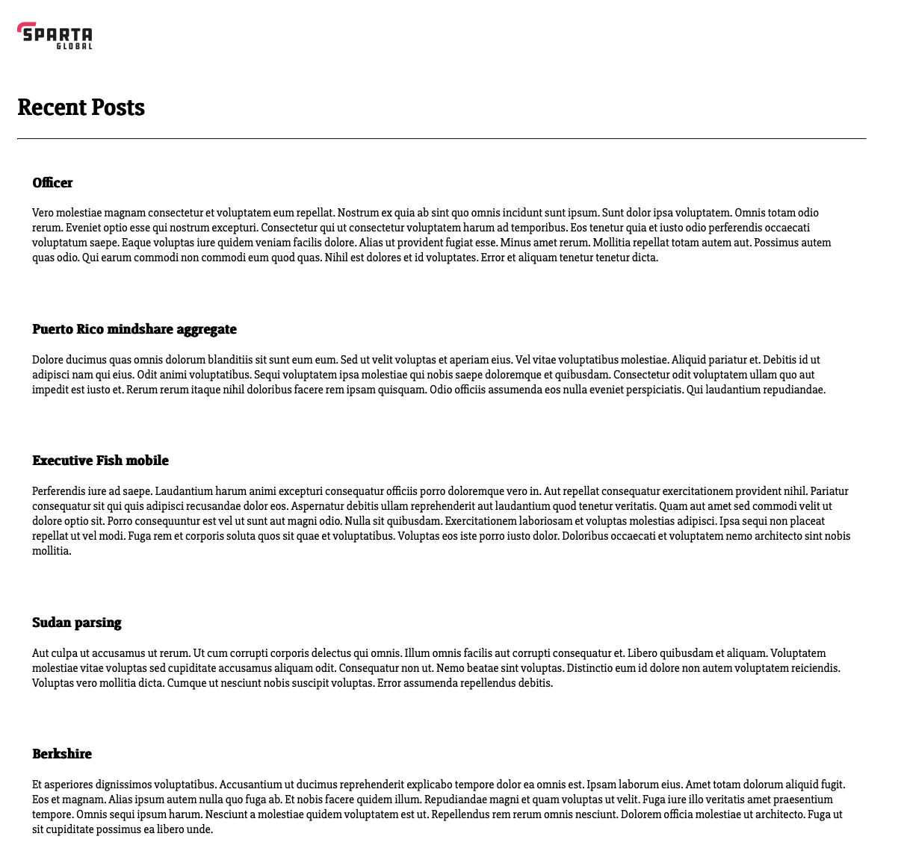

# Jenkins

- [Jenkins](#jenkins)
  - [Setup your own Jenkins Server](#setup-your-own-jenkins-server)
    - [Instance Configuration](#instance-configuration)
    - [Installation Commands for Debian/Ubuntu](#installation-commands-for-debianubuntu)
      - [Java Installation](#java-installation)
      - [Jenkins Installation](#jenkins-installation)
    - [Get Started Commands](#get-started-commands)
    - [Post Installation Wizard](#post-installation-wizard)
    - [Plugins installation](#plugins-installation)
    - [Create first admin user](#create-first-admin-user)
    - [Further plugins installation](#further-plugins-installation)
    - [HostKeyStrictChecking](#hostkeystrictchecking)
    - [Job Configuration](#job-configuration)

## Setup your own Jenkins Server

- Type: single node setup i.e. no agent (worker) nodes

### Instance Configuration

- Image: `Ubuntu 22.04 LTS`
- Size: `t3.small`
- VPC: `tech501-sameem-2-subnet-vpc-vpc`
  - Subnet: `tech501-sameem-2-subnet-vpc-subnet-public1-eu-west-1a`
- NSG rules: allow ssh and http, local machine access only

### Installation Commands for Debian/Ubuntu

#### Java Installation

```bash
sudo apt update
sudo apt install openjdk-21-jdk -y
java -version
```

#### Jenkins Installation

1. Add Jenkins Repository

- use Jenkins project repository rather than default Ubuntu repository as it is likely to be the latest available version.
- follow the steps below to add the Jenkins repository to your Ubuntu system.

```bash
sudo wget -O /usr/share/keyrings/jenkins-keyring.asc https://pkg.jenkins.io/debian-stable/jenkins.io-2023.key
```

2. Add the Jenkins software repository to the source list and provide the authentication key.

```bash
echo "deb [signed-by=/usr/share/keyrings/jenkins-keyring.asc]" https://pkg.jenkins.io/debian-stable binary/ | sudo tee \
/etc/apt/sources.list.d/jenkins.list > /dev/null
```

- The command adds the Long Term Support (LTS) stable release to the sources list.

3. Install Jenkins

- update system repository and install.

```bash
sudo apt update
sudo apt install jenkins -y
```

- check if jenkins is installed and running.

```bash
sudo systemctl status jenkins
```

### Get Started Commands

- start at boot: `sudo systemctl enable jenkins`
- start service: `sudo systemctl start jenkins`
- check status: `sudo systemctl status jenkins`

### Post Installation Wizard

- When you first access a new Jenkins controller, you are asked to unlock it using an automatically-generated password, stored in: `sudo cat /var/lib/jenkins/secrets/initialAdminPassword`

### Plugins installation

- Have chosen `Install suggested plugins` for now.

### Create first admin user

- Post plugins page, will ask you to create first admin user.
- Enter username and password etc.
- Will be able to start using Jenkins after this!

### Further plugins installation

- Need to install NodeJS for job 1 below.

### HostKeyStrictChecking

- Manage Jenkins -> Security -> HostKeyStrictChecking = No
- Need to do this else will get SSH authentication issues.

### Job Configuration

- See week_3 notes for specific configuration fields.
- Will need to add private keys to Jenkins of course e.g. for GitHub and prod EC2 access.
- Also need to change webook settings on GitHub to point to new Jenkins server.
- Be careful of the file paths for Job 3 - may be different to what we had previously.
- if the pipeline is configured properly, git push from local machine to repo should trigger it and if all 3 jobs pass, will show the change in the webpage.



